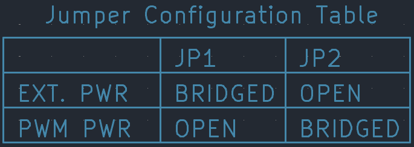

# Project NEO Zia
This circut board is intended to make the New Mexico Zia out of LED's  

## Using the board
This section goes over information on how to configure, wire, and mount the board. 
### Configuration
This PCB is designed to accept power from an external 12 volt input. It is also able to recieve power from a 5 volt PWM cable. By default the board is configured to recieve power from the 12 volt external power input.  
- For the PWM power input open JP1 and bridge JP2
- For external power input open JP2 and bridge JP1  

> **NEVER BRIDGE BOTH JUMPERS AT ONCE**
### Wiring
#### External Power Input
The external power input can accept voltages between 5 and 12 volts. When using the external power input fuse it at a maximum of 5 amps.  

#### PWM Connections
There are two PWM connections on the board. One is a PWM output and one is an input. The output connector outputs a PWM signal after it has passed through all LED's. If you want to power the board with the PWM connection refer to the configuration section of this doccument.  

>- The PWM output connector outputs whetever voltage it is provided through the PWM input  
>- The PWM output **does not touch the voltage regulator on the board at all**  
>- The pinout of these connectors is also labeled on the board  
### Mounting
On the newest revisions the 4 center holes are 3/16 and sized for 10/24 screws. Each revision has a STEP file in it's folder.  
> For all revisions, I would suggest that you check the mounting hole spacing and size in the CAD model
## Manufacturing
If you want to make this board you can either use the pre-made gerber files or customize them using the KiCad project files. All these files are available in the revision folders. The latest version can also be found on the releases page.
### Pre-Made Gerbers
In each revision folder there are zip files. These are the gerber's and you should be able to drop them straight in you PCB manufacturing service.  
> Some PCB manufacturing services will accept the bare KiCad PCB file.   
>**Read the REVISION NOTES.txt for info on what changed between each revision** 
### Customization  
If you want to customize this board each revision folder has a KiCad project file, a KiCad PCB File, and a KiCad Schematic file. 
> I suggest you use KiCad 9 or higher.  
>**Read the REVISION NOTES.txt for info on what changed between each revision**  
## Credit  
If you customize your board please leave the designer name and a link to the github repo on the board  
**Designed by Josh Rodriguez for FIRST Robotics Competition Team 1164 Project NEO**
